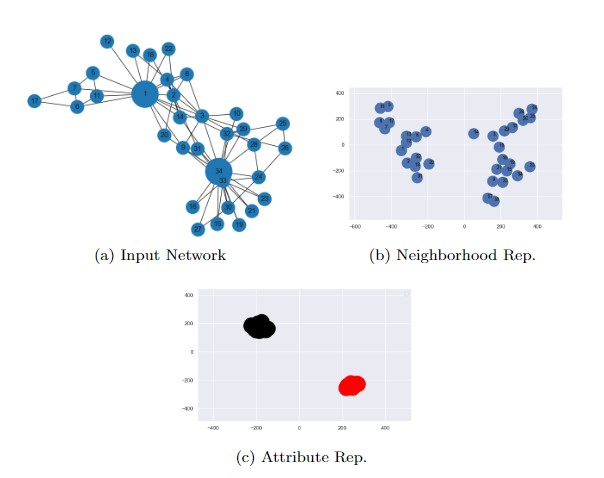

# snefan
A Semi-supervised Node Embedding Framework for Attributed Networks

## Description
A scalable Framework for learning representation for network nodes, while preserving the neighborhood topology and node contextual attributes in the Learned Embedding. This method improves upon the random walk approach through a decision function, which learn quality vector representations useful for different downstream learning tasks. The probability walk builds a node corpus comprising sampled nodes with similar contextual attributes and structural patterns, which is trained using a NLP (natural language processing) technique. We evaluate the effectiveness of our model by comparing it with other baseline methods on three downstream tasks: Clustering, Link Prediction, and Node Classification. Our model shows better performance compared to these baselines.

## Visuals


## Installation 
The codes are written in Python 3 environment.

Use the package manager pip to install the necessary python libraries

```
pip install gensim
pip install numpy
pip install networkx
pip install tqdm
```
